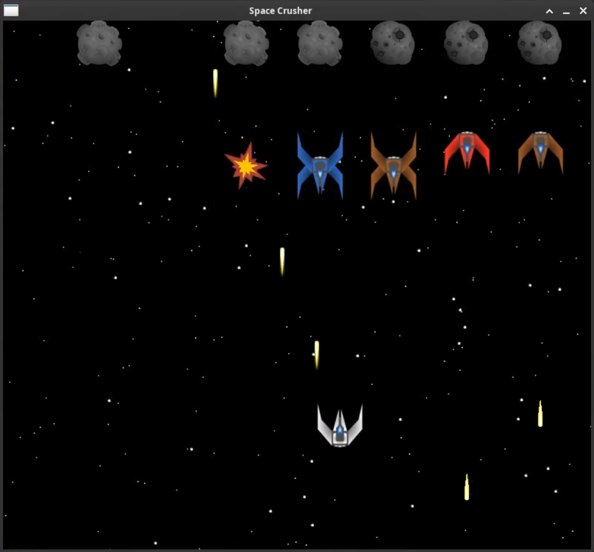

# Space Crusher

## Description

Space Crusher is a 2D space shooter game being developed in C using the SDL (Simple DirectMedia Layer) library.

## Features

- Object Collision: Implemented collision detection for the spaceship, enemy spaceships, bullets, and asteroids.
- Health Bar: A health bar that decreases when bullets collide with the spaceship.
- Sandbox Level: A sandbox level for testing and demonstration purposes.

## Technologies Used

- C Language: Core game logic and rendering pipeline developed entirely in C.
- SDL Library: Utilized for creating the game window and rendering objects.

## Development Status

Space Crusher is currently in development and is not yet complete. Future updates will include additional levels, improved gameplay mechanics, and enhanced graphics.

## Disclaimer

This project is intended for educational and non-commercial use only. For any questions or contributions, please contact me on [LinkedIn](https://www.linkedin.com/in/cristian-scheid/).
